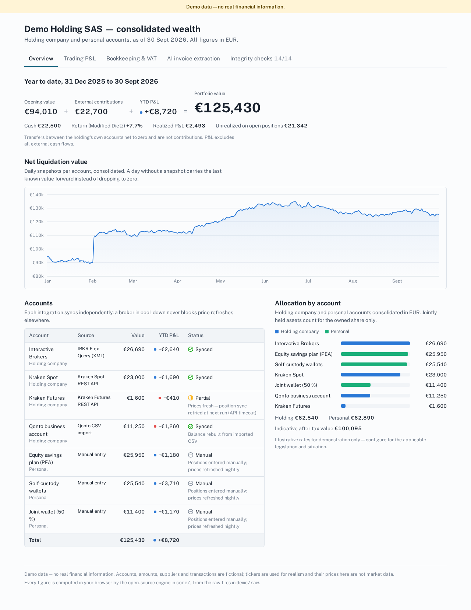
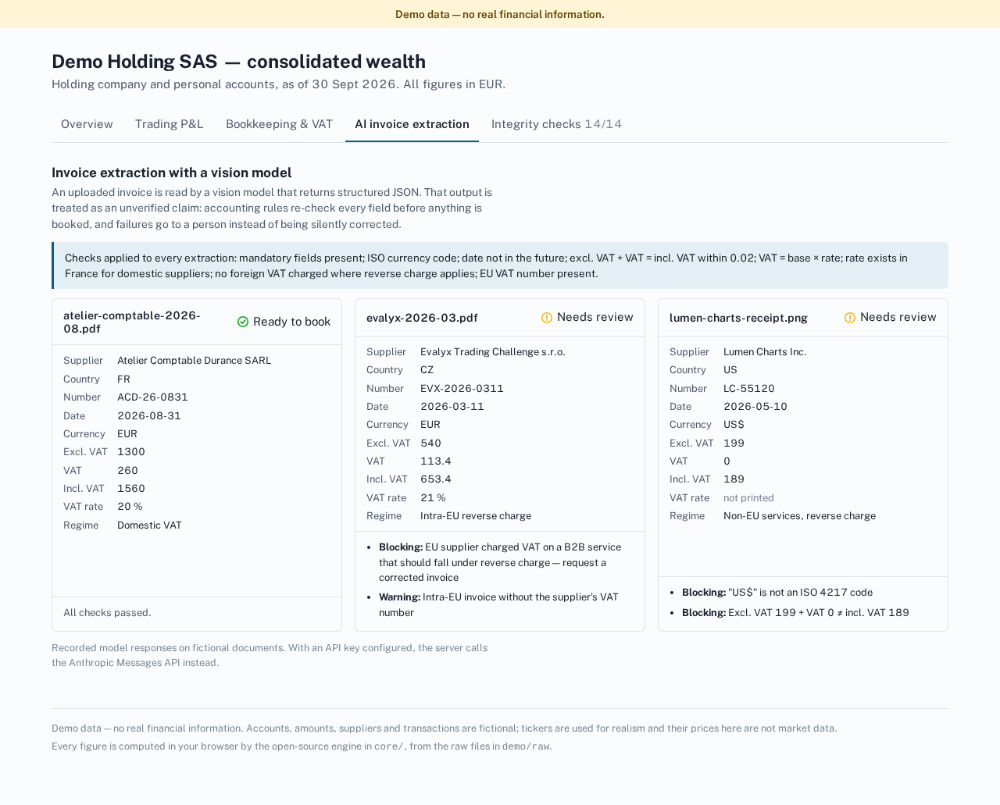
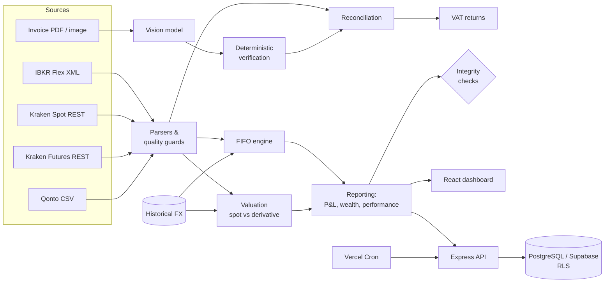

# Financial Portfolio Dashboard — Showcase

**Multi-account wealth and bookkeeping engine for a holding company: broker statements in, audited numbers out.**

**▶ Live demo: [fabolousfab7.github.io/financial-portfolio-dashboard-showcase](https://fabolousfab7.github.io/financial-portfolio-dashboard-showcase/)** — every figure is computed in your browser from the raw demo files.

> **Demo data — no real financial information.**
> Every account, amount, supplier and transaction in this repository is fictional. Tickers are used for realism only; their prices here are not market data.

[](https://github.com/fabolousfab7/financial-portfolio-dashboard-showcase/actions/workflows/pages.yml)     



---

## What this is

I run my holding company's portfolio and books on a private production system that consolidates broker, exchange and bank accounts into one view. This repository is a **public, clean-room showcase** of that system: the financial engine is rewritten from scratch, every external integration is replaced by fictional fixtures in the same formats (an IBKR Flex XML statement, Kraken fills, a Qonto CSV export), and the dashboard computes every figure from those raw files at load time.

The point is not the UI. The point is the financial logic: what each number means, which edge cases break naive implementations, and how the system proves its own figures are consistent.

| Headline (computed, not hard-coded) | Value |
|---|---|
| Portfolio value | **€125,430** |
| YTD P&L (external flows excluded) | **+€8,720** |
| Cash | **€22,500** |
| Integrity checks passing | **14 / 14** |

## Features

| Area | What is implemented | Where |
|---|---|---|
| **Multi-account aggregation** | Holding-company and personal accounts consolidated in EUR; jointly held assets at their owned share | `core/valuation.ts` |
| **Interactive Brokers Flex Query** | Two-phase non-blocking client (SendRequest → GetStatement), XML parsing, error-code classification, bounded HTTP timeouts | `core/ibkr-flex.ts` |
| **XML parsing & data-quality guards** | A degraded statement (all quantities or all cost prices at zero) can never overwrite valid stored positions | `assessReportQuality` |
| **Kraken Spot / Futures** | HMAC request signing, legacy asset codes, pair classification, perpetual round-trips, holding-fee mapping to the French chart of accounts | `core/kraken*.ts` |
| **Deterministic FIFO P&L** | Per-ticker lot matching, gross vs net of fees, partial lots, quantity-weighted holding period, null (never zero) P&L on missing cost basis | `core/fifo.ts` |
| **Historical FX** | ECB-convention rates, weekend roll-back, conversion per line before aggregation, no silent fallback | `core/fx.ts` |
| **Bank reconciliation (Qonto)** | French CSV import with idempotent de-duplication; auto-match, ranked suggestions, one-to-one assignment | `core/qonto.ts`, `core/reconciliation.ts` |
| **French VAT module** | Monthly CA3 lines 16 to 28, reverse charge on EU and non-EU services, 760 € refund threshold, credit carried month to month | `core/vat.ts` |
| **AI invoice extraction** | Vision-model OCR to structured JSON, then deterministic verification before anything is booked | `core/invoice-extraction.ts` |
| **Wealth reporting** | Gross and indicative after-tax value by entity and asset class, with explicit, configurable tax assumptions | `core/wealth.ts` |
| **Performance** | Opening + contributions + P&L roll-forward, Modified Dietz return, carry-forward of missing snapshots | `core/timeseries.ts` |
| **Dashboard** | React + Recharts, light and dark themes, responsive, every status shown with icon and label | `web/` |
| **API & cron** | Express routes, Vercel Cron nightly job with independent steps and a fail-closed bearer secret | `server/`, `api/` |
| **Database** | PostgreSQL schema with Row Level Security on every user table and unreachable credential storage | `supabase/schema.sql` |

## Financial methodology

These are the rules the engine enforces. Each one exists because the naive version produces a wrong number that looks plausible.

**FX is applied per leg, not on the difference.** A US stock bought at EUR/USD 1.05 and valued at 1.17 can be up in dollars and down in euros. Unrealized P&L is `qty × price ÷ fx_today − cost basis in EUR at the purchase-date rate`; realized P&L converts proceeds at the sale date and each consumed lot at its own purchase date. The *Closed trades* table isolates the currency effect.

**Convert, then sum.** Every amount is converted at its own date before aggregation. Summing USD, EUR and GBP first and converting the total is wrong. A missing rate raises an error instead of defaulting to 0 or 1.

**Derivatives are not assets at notional.** A perpetual or future contributes its mark-to-market only (`qty × (mark − entry) × multiplier`); the margin is already in cash. Valuing a perp at `qty × price` inflates net worth by the full notional. Spot and derivatives therefore go through one shared helper that branches on asset class.

**FIFO is deterministic and honest about gaps.** Fills are ordered by timestamp then id, so the same history always gives the same matching. A sale that exceeds the known lots (history truncated by an API window, transfer-in without cost basis) is flagged and its P&L is `null`, never computed against a zero cost.

**Broker figures are re-derived, not trusted.** The engine recomputes IBKR's `fifoPnlRealized` from executions and must agree to the cent (it is already net of commission, so commission is never deducted twice). Realized P&L is read at the closed-lot level when the statement provides it.

**Crypto-to-crypto swaps are disposals.** For a company there is no deferral: each swap is split into a sale of the disposed asset and a purchase of the acquired asset at the same EUR fair value, so both assets keep a consistent FIFO history and the gain is booked on the swap date.

**Performance strips cash flows.** YTD P&L is `closing − opening − external contributions`; transfers between the company's own accounts net to zero. The return uses Modified Dietz so a large mid-year contribution does not distort it.

**A degraded data source never destroys good data.** Statements with all-zero quantities or cost prices, or an empty cash report, are rejected for replacement. A broker in cool-down does not stop price refreshes for other accounts: the account shows *partial* rather than failing.

**VAT follows the form.** Reverse-charge VAT on EU and non-EU services is self-assessed as due (line 16) and deductible (line 23); a credit is refunded only above the monthly threshold, otherwise carried to the next return's line 22.

## AI in this project

**As a feature.** Invoices are read by a vision model (Anthropic Messages API) that returns JSON. That output is treated as an unverified claim and re-checked: mandatory fields, ISO currency, future dates, `excl. VAT + VAT = incl. VAT`, `VAT = base × rate`, French VAT rates, foreign VAT charged where reverse charge applies, missing EU VAT number. The demo replays three recorded model outputs: one clean, one where the supplier wrongly charged foreign VAT, and one OCR misread (`199` read as `189`, `US$` instead of `USD`). Both faulty ones are routed to review.



**As a development method.** The production system and this showcase were built with AI-assisted development. I define the financial specification, decide what each figure must mean, and verify the output; the model accelerates implementation. Most of the real work is the review loop: spotting where generated code is subtly wrong — an inline formula that drops the derivative branch, a hard-coded FX rate, a commission deducted twice — and turning each finding into a rule and a test. [`docs/AI-EVALUATION.md`](docs/AI-EVALUATION.md) lists the failure patterns this surfaced.

## Architecture



## Stack

TypeScript (strict) · React 19 · Recharts · Vite · Express · PostgreSQL / Supabase · Vitest · Vercel (API + cron configuration) · GitHub Actions (CI + Pages demo) · Anthropic API

## Project structure

```
core/                 Framework-free financial engine (pure functions, fully tested)
  fifo.ts             FIFO lot matching and realized P&L
  fx.ts               Historical FX provider and conversion rules
  valuation.ts        Spot vs derivative valuation, NLV
  ibkr-flex.ts        Flex Web Service client, XML parser, quality guards
  kraken.ts           Asset/pair normalization, swaps, perp round-trips, fee mapping
  kraken-auth.ts      Request signing (server-only)
  qonto.ts            French CSV import
  reconciliation.ts   Invoice ↔ bank matching
  vat.ts              Monthly CA3 computation
  invoice-extraction.ts  Vision-model extraction and verification
  timeseries.ts       Consolidation, carry-forward, Modified Dietz
  wealth.ts           Entity / asset-class reporting
demo/                 Fictional fixtures and the dataset builder
  raw/ibkr-flex-sample.xml   Generated Flex statement (fictional)
server/, api/         Express API and Vercel entry point
.github/workflows/    CI: tests, build and GitHub Pages deployment of the demo
web/                  React dashboard
supabase/schema.sql   Reference schema with Row Level Security
tests/                69 unit, integration and API tests
```

## Run it

```bash
npm install
npm test            # 69 tests
npm run dev         # dashboard on http://localhost:5173
npm run server      # API on http://localhost:8787
npm run build       # type-check + production build
```

No API key or database is needed: the demo runs entirely on the fixtures. See `.env.example` for the optional variables.

| Endpoint | Purpose |
|---|---|
| `GET /api/portfolio/summary` | KPIs, accounts, wealth report |
| `GET /api/portfolio/timeseries?days=` | Consolidated NLV series |
| `GET /api/positions` | Open positions with EUR value and unrealized P&L |
| `GET /api/trades/realized` | Closed trades, lot matching, broker cross-check, perps, swaps |
| `GET /api/compta/reconciliation` | Matches, suggestions, open items |
| `GET /api/compta/vat-returns` | Monthly VAT returns |
| `POST /api/ibkr/parse` | Parse an uploaded Flex statement and report whether it is safe to apply |
| `POST /api/compta/invoices/verify` | Verify a model-extracted invoice |
| `GET /api/cron/daily` | Nightly job (bearer `CRON_SECRET`, closed when unset) |

## Security and privacy

- No real data, no credentials and no account identifiers anywhere in the repository or its history.
- Broker keys are read-only, stored encrypted server-side in a table with RLS enabled and no policy, so no client key can read them.
- Every user table has Row Level Security with an owner policy; service-role access is limited to server jobs.
- The cron endpoint uses a constant-time secret comparison and refuses to run when the secret is not configured.
- Financial responses are sent with `Cache-Control: no-store`; errors never return upstream payloads or stack traces.

## Limitations

- Long-only spot FIFO; short spot positions are out of scope (derivatives are handled as round-trips).
- The VAT model covers the cases a holding company meets (domestic, intra-EU and non-EU services); goods imports, partial deduction ratios and annual regimes are not modelled. Not tax advice.
- Tax rates in the wealth report are illustrative parameters.
- Amounts are IEEE doubles with compensated summation and rounding at the boundaries; a production ledger would store integer minor units.

## Author

**[fabolousfab7](https://github.com/fabolousfab7)** — Master's degree in Audit & Finance. Finance, accounting and treasury background; active in equity, futures and digital-asset markets. I design and build financial applications with AI-assisted development, with a focus on financial logic, data flows, APIs, accounting workflows and the evaluation of model output.

[GitHub profile](https://github.com/fabolousfab7)

## License

MIT — see [LICENSE](LICENSE).
